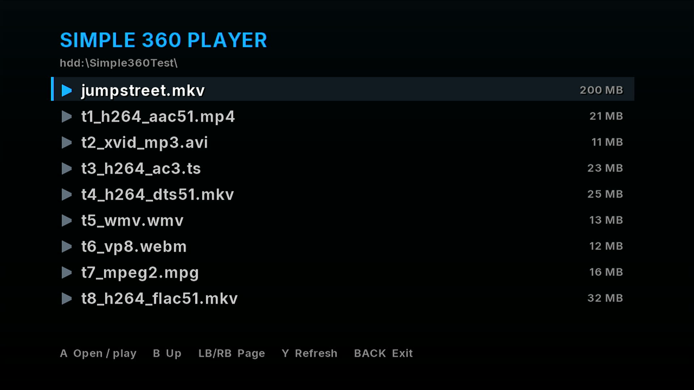

# Simple 360 Player

A video player for modded (RGH/JTAG) Xbox 360 consoles. Plays videos from the hard drive, USB drives or a disc.

## Install

1. Download `Simple360Player-x.y.zip` from [Releases](../../releases).
2. Unzip it and copy the `Simple360Player` folder to your console (FTP or a USB stick), e.g. to `Hdd1:\Apps\`.
3. Start `default.xex` from Aurora, FSD or XeXMenu.

It only writes `settings.ini` and a log next to `default.xex`.

## What it plays

- **Files:** MKV, MP4, M4V, MOV, AVI, TS, M2TS, MPG, WMV, FLV
- **Video:** H.264 up to 720p, Xvid/DivX, MPEG-2, WMV/VC-1. 1080p H.264 is too heavy for the 360's CPU.
- **Sound:** AAC, AC3, DTS, MP3, FLAC, WMA. 5.1 stays 5.1.
- **Subtitles:** an `.srt` file next to the video with the same name (e.g. `movie.en.srt`), and text subtitles inside MKV/MP4.
- **Not supported:** H.265/HEVC, VP8/VP9, AV1.

## Controls

| | Browser | Playing |
|---|---|---|
| A | Open / play | Pause |
| B | Up a folder | Back to the browser |
| Left / Right | | Seek 10 s (hold to go faster) |
| LB / RB | Page up / down | Seek 5 min |
| Up / Down | Move | Show / hide the timeline |
| X | | Aspect ratio: Auto, Zoom, Stretch, 4:3, 16:9 |
| Y | Refresh | Options: audio, subtitles, brightness, aspect ratio, stats |
| Back | Exit | |

## Building

Needs the Xbox 360 XDK (2.0.21256) and Visual Studio 2010 SP1. Build FFmpeg first
(`external/ffmpeg360/vcproj/libavcodec/libavcodec.vcxproj`), then `SimplePlayer.vcxproj`
(Release, platform `Xbox 360`).

This repository also holds [Multiplex 360](https://github.com/HG-ERIK/multiplex360), a Plex client
for the Xbox 360 that shares the same player (`PlexClient.vcxproj`).

## Credits

- [FFmpeg](https://ffmpeg.org) 0.7, from the FFPlay360 port
- [mbedTLS](https://github.com/Mbed-TLS/mbedtls) 2.16
- [Inter](https://rsms.me/inter/) font (SIL Open Font License)

Not affiliated with Microsoft. Licensed under the GPLv3.
